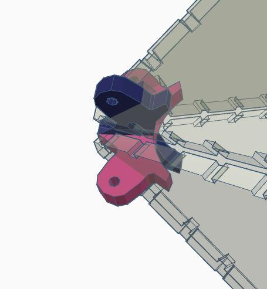

# Infinity Mirror Octahedron - Version 2
 

Design files for Infinity Mirror Octahedron shown above. This version has the following differences from Version 1:
- It has larger mirrored sizes. The size of the sides was the largest such that I could cut 8 of them from the same 12" high acrylic sheet
- The corner connectors attach to the sides differently, and are fastened in place with M2 screws and nuts (5 or 6 mm in length works well)
- It uses a narrower LED strip (details below). This produces a less disrupted view of the octahedron's interior
- The LED strip is would around all octahedron edges in a continuous line, with no soldering

The design was created to use an LED strip containing 2020 sized LEDs with a pixel density of 96 LEDs/m. It is 4 mm wide. It is an unusual strip, which I purchased <a href="https://www.aliexpress.com/item/1005001827157531.html">on AliExpress</a>. Because of the LED strip spacing, I was able to wrap the entire strip around the ocahedron in a continuous line without splicing it, which makes the build much easier. If you do plan to cut and solder this strip be warned that its narrowness makes it a challenge to solder.

Cut **8** of the triangular side pieces from <a href="https://www.amazon.com/gp/product/B01G4MQ5OW">3mm two-way mirrored acrylic</a> and **6** each of the two connector pieces (inner connector depicted pink, outer connector depicted blue)  from 1/8" clear acrylic.

Assemble four of the triangle pieces as shown by slotting them together with the six inner connectors. Secure the inner connectors to the sides by securing 5mm or 6mm M2 sized screws through the connectors' holes. When assembling, it's best to have the mirrored face of the acrylic pieces facing the octahedron's interior, to protect it from scratches. Wearing gloves during the assembly will reduce the number of fingerprints on the mirrored surface.

  
Add the remainging four pieces by slotting them together with the outer connectors and sliding the outer connectors over the inner connectors. Secure all connectors to the mirrored sides using M2 screws and nuts.

  
Once the octahedron is assembled, you can wrap the LED strip segments around the outside edges of the octahedron so that each LED is nestled into its own cutout. I used small pieces of <a href="https://www.amazon.com/Glue-Dots-Line-Clear-Lines/dp/B00NGAZURO">glue dots lines</a> to hold the strips in place. You should be able to wind the strip in a single sequence that wraps exactly once around every edge of the octahedron. You will need to pinch the corners of the strip at the bends to crease it.
