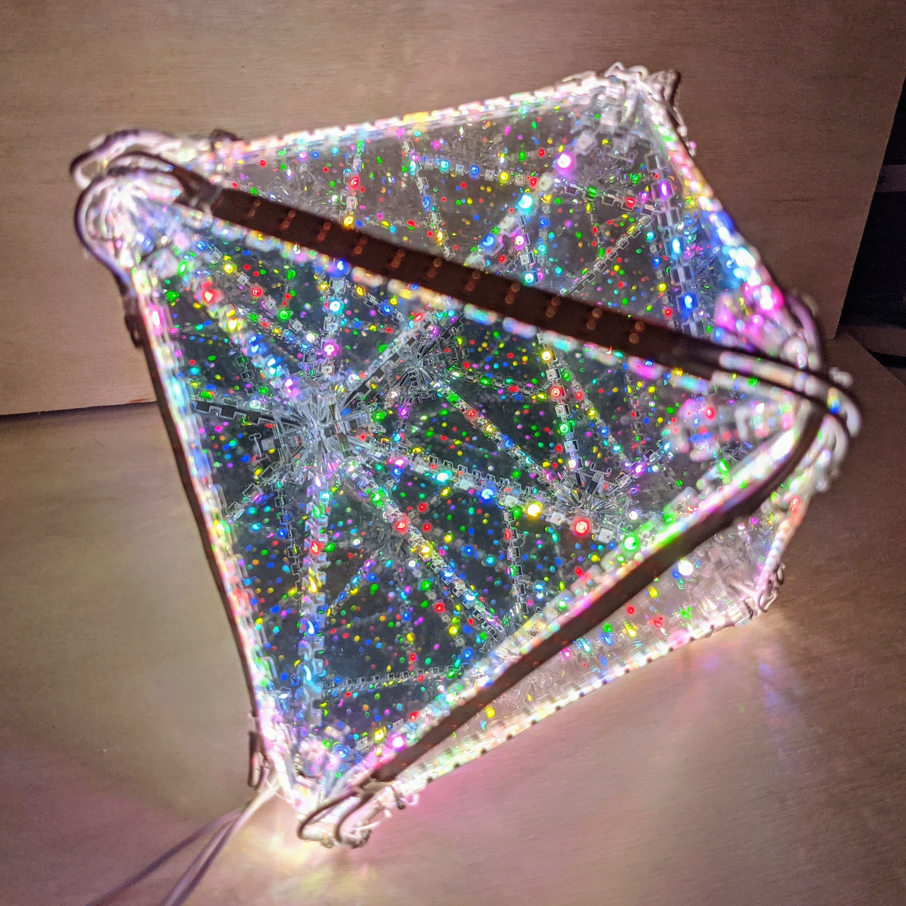
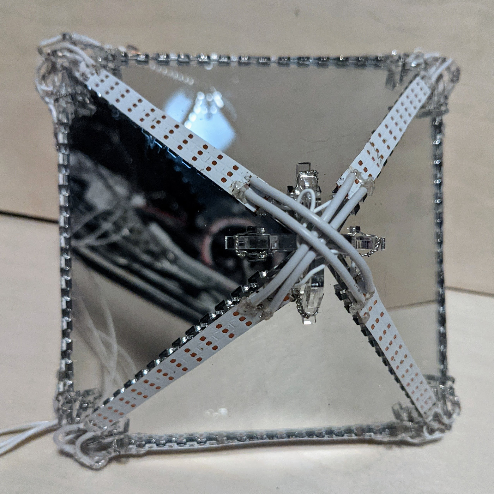
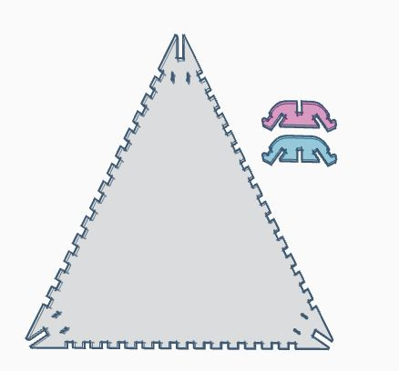
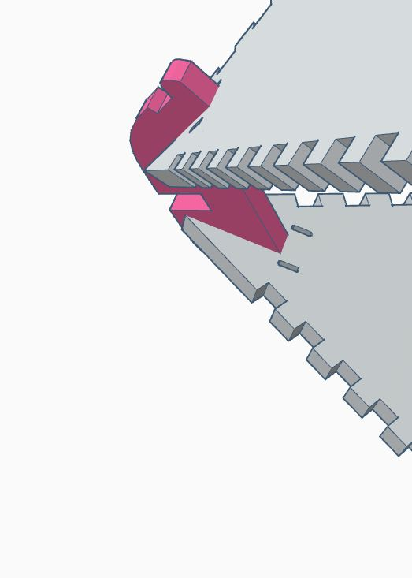
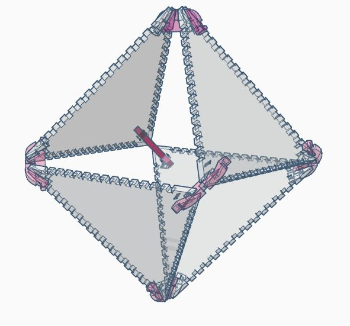
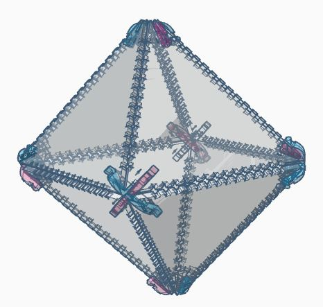

# Infinity Mirror Octahedron
 

Design files for Infinity Mirror Octahedron shown above. The design files were created to use 12 segments of LED strip containing 144 LEDs/m. Each segment contains 14 LEDs.

Cut **8** of the triangular side pieces from <a href="https://www.amazon.com/gp/product/B01G4MQ5OW">3mm two-way mirrored acrylic</a> and **6** each of the two connector pieces (inner connector depicted pink, outer connector depicted blue)  from 1/8" clear acrylic.

Assemble four of the triangle pieces as shown by slotting them together with the six inner connectors. Secure the inner connectors loosely (you will tighten them later) with craft wire or other thin wire running through the holes in the edge and twisted around the connectors' legs. Make sure the twisting occurs on the outside of the octahedron. When assembling, it's best to have the mirrored face of the acrylic pieces facing the octahedron's interior, to protect it from scratches. Wearing gloves during the assembly will reduce the number of fingerprints on the mirrored surface.

  
Add the remainging four pieces by slotting them together with the outer connectors and sliding the outer connectors over the inner connectors. Secure all connectors to the mirrored sides using craft wire.

  
Once the octahedron is assembled, you can wrap the LED strip segments around the outside edges of the octahedron so that each LED is nestled into its own cutout. I used small pieces of <a href="https://www.amazon.com/Glue-Dots-Line-Clear-Lines/dp/B00NGAZURO">glue dots lines</a> to hold the strips in place. You should be able to solder together all strips in a single sequence that wraps exactly once around every edge of the octahedron.
